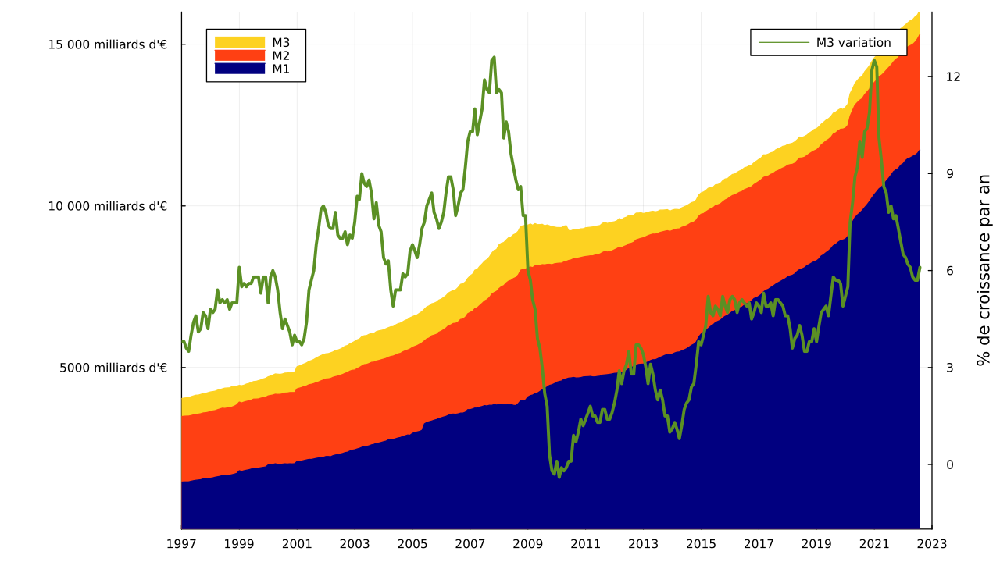

⚠️ brouillon

Scripts permettant de récupérer et d'afficher automatiquement les données de la masse monétaire euro.

## Données

Monetary aggregate

- M1
- M2
- M3

vis-a-vis euro area non-MFI excl. central gov. reported by MFI & central gov. & post office giro Inst. in the euro area

- stock
- transaction
- index

Labels

```
BSI.M.U2.Y.V.M10.X.1.U2.2300.Z01.E
BSI.M.U2.Y.V.M10.X.4.U2.2300.Z01.E
BSI.M.U2.Y.V.M10.X.I.U2.2300.Z01.A

BSI.M.U2.Y.V.M20.X.1.U2.2300.Z01.E
BSI.M.U2.Y.V.M20.X.4.U2.2300.Z01.E
BSI.M.U2.Y.V.M20.X.I.U2.2300.Z01.A

BSI.M.U2.Y.V.M30.X.1.U2.2300.Z01.E
BSI.M.U2.Y.V.M30.X.4.U2.2300.Z01.E
BSI.M.U2.Y.V.M30.X.I.U2.2300.Z01.A

BSI.M.U2.Y.V.M30.X.I.U2.2300.Z01.V (moving average)
```

J'ai récupéré les clés et descriptions avec `scrap.jl` pour les mettre dans les fichiers `keys.txt` et `titles.txt`.

J'ai téléchargé les fichiers `.csv` avec `download_csv.jl`.

## Affichage

J'ai généré la figure à partir des données `*.csv` avec le script `plot_monetary_mass.jl`.

