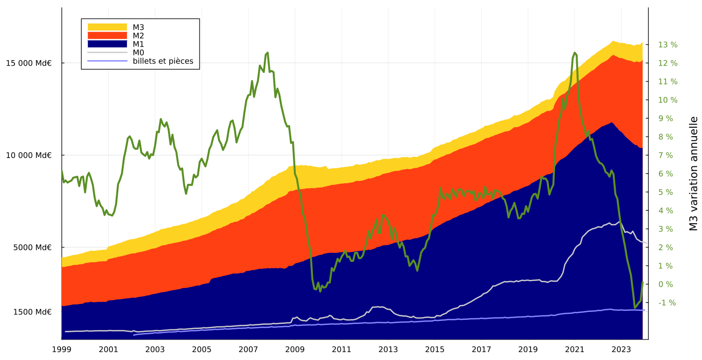

# Masse monétaire euro

Scripts permettant de récupérer et d'afficher automatiquement les données de la masse monétaire euro depuis le site officiel https://sdw.ecb.europa.eu/.

## Données

Affiche les données suivantes :

- `BSI.M.U2.Y.V.M10.X.1.U2.2300.Z01.E` agrégat monétaire M1
- `BSI.M.U2.Y.V.M20.X.1.U2.2300.Z01.E` agrégat monétaire M2
- `BSI.M.U2.Y.V.M30.X.1.U2.2300.Z01.E` agrégat monétaire M3
- `BSI.M.U2.Y.V.M30.X.I.U2.2300.Z01.A` variation de M3 lissée
- `ILM.M.U2.C.LT00001.Z5.EUR` base monétaire
- `BKN.M.U2.NC10.B.ALLD.AS.F.E` billets en circulation
- `BKN.M.U2.NC10.C.ALLD.AS.F.E` pièces en circulation

Non affiché :

- `ILM.W.U2.C.L020200.U2.EUR` facilités de dépôt
- `ILM.W.U2.C.L020100.U2.EUR` réserves des institutions financières monétaires "IFM" (banques)

## Scripts

`scrap.jl` récupère l'index HTML et en extrait la liste de clés et leurs définitions (disponibles dans les fichiers `keys.txt` et `titles.txt`)

`download_csv.jl` télécharge les fichiers `.csv` pour les clés sélectionnées et les places dans le dossier `data/`

`plot_monetary_mass.jl` génère la figure suivante à partir des fichiers `.csv` précédents

